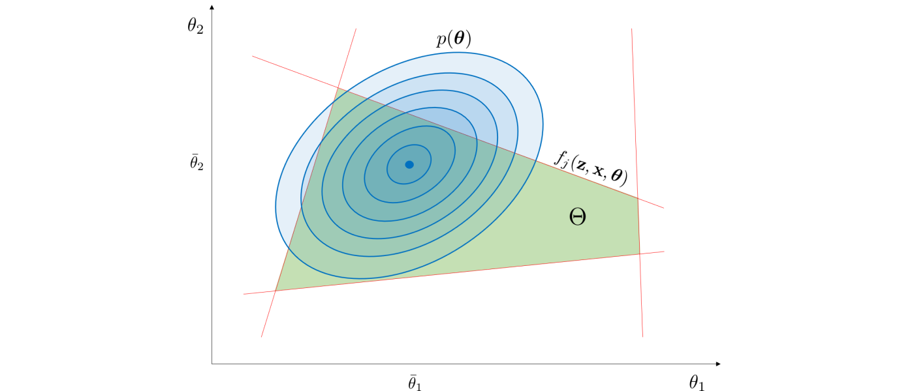
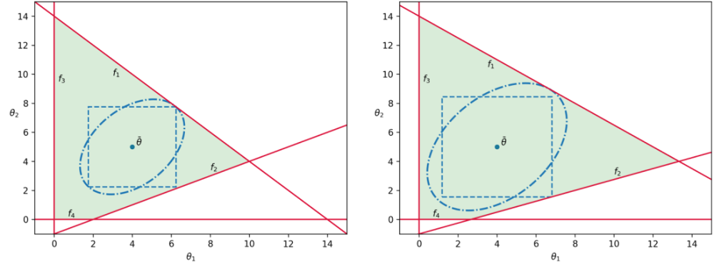
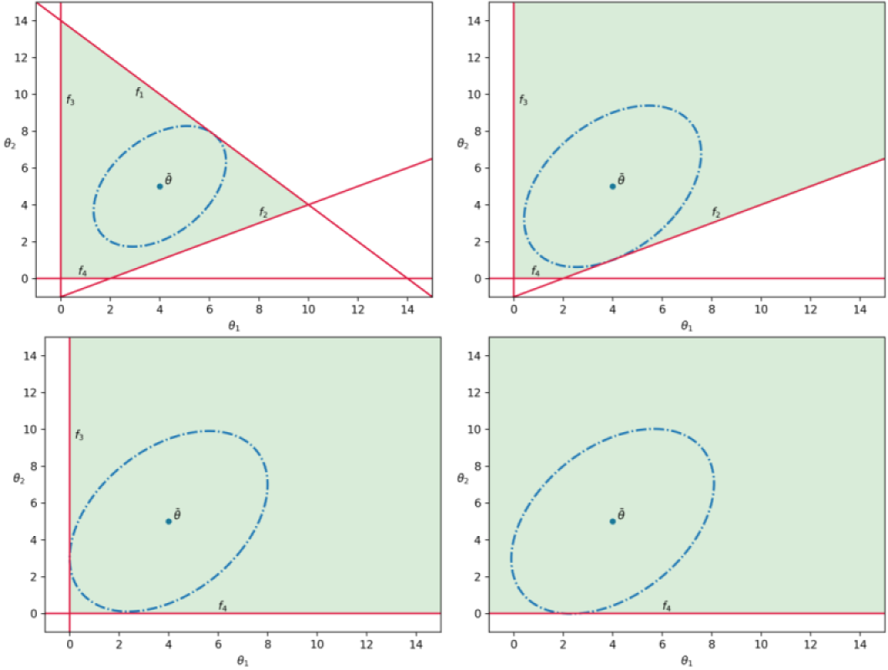

```@meta
CurrentModule = FlexibilityAnalysis
```
# Background
This page provides a background on the theory and methods that form the
computational framework that is implemented by FlexibilityAnalysis to quantify and analyze
system flexibility. This is not a rigorous or complete review and more information
is provided [here](https://docs.google.com/a/wisc.edu/viewer?a=v&pid=sites&srcid=d2lzYy5lZHV8emF2YWxhYnxneDo3MDJkNmFhMDc0MGRlY2Qz)

## System Characterization
We consider general systems that are subjected to random variation and attempt
to counteract it via recourse (if there is recourse). We characterize these
systems as having random variables ``\boldsymbol{\theta} \in \mathbb{R}^{n_{\theta}}``,
recourse variables ``\mathbf{z} \in \mathbb{R}^{n_{z}}``, state variables
``\mathbf{x} \in \mathbb{R}^{n_{x}}``, equality constraints
``h_i(\mathbf{z}, \mathbf{x}, \boldsymbol{\theta}) = 0, \, i \in I,`` and
inequality constraints ``f_j(\mathbf{z}, \mathbf{x}, \boldsymbol{\theta}) \leq 0, \, j \in J``.
The feasibility (meaning there exists recourse to satisfy the system constraints)
of a particular instance of ``\boldsymbol{\theta}`` is evaluated via the feasibility
function ``\psi(\boldsymbol{\theta})`` which is

```math
\begin{equation}
	\begin{aligned}
		&\psi(\boldsymbol{\theta}) = &\min_{\mathbf{z}, \mathbf{x}, u \in \mathbb{R}} &&& u \\
		&&\text{s.t.} &&& f_j(\mathbf{z}, \mathbf{x}, \boldsymbol{\theta}) \leq u, & j \in J \\
		&&&&& h_i(\mathbf{z}, \mathbf{x}, \boldsymbol{\theta}) = 0, & i \in I
	\end{aligned}
\end{equation}
```
where ``\boldsymbol{\theta}`` is feasible if ``\psi(\boldsymbol{\theta}) \leq 0``.
This feasible function is what the [`ismeanfeasible`](@ref) and
[`findstochasticflexibility`](@ref) functions use to evaluate feasibility of
particular instances of ``\boldsymbol{\theta}``. The set of all feasible instances
of ``\boldsymbol{\theta}`` forms the feasible region
``\Theta := \{\boldsymbol{\theta}\,:\,\psi(\boldsymbol{\theta}) \leq 0\}``
which is illustrated below.


## Stochastic Flexibility Index Problem
The stochastic flexibility index ``SF`` is a flexibility metric for systems that
are subjected to uncertain parameters (e.g., disturbances, physical parameters)
that are modeled as random variables, and is defined as the probability of finding
recourse to maintain feasible operation. This can be computed by integrating the
probability density function ``p:\mathbb{R}^{n_{\theta}}\to \mathbb{R}`` of the
random parameters over the feasible region:

```math
\begin{equation}
	SF := \int_{\boldsymbol{\theta}\in\Theta} p(\boldsymbol{\theta}) d\boldsymbol{\theta} = \mathbb{P}\left( \psi(\boldsymbol{\theta}) \leq 0 \right).
\end{equation}
```

This is illustrated below for a multivariate Gaussian distribution.



The ``SF`` index can be computed rigorously via Monte Carlo (MC) sampling. This
is done by assessing the feasibility of each realization. Such an approach converges
exponentially with the number of MC samples but typically requires a very large
number of samples leading to scalability issues. One possible alternative is to
estimate the stochastic vulnerability index ``SV := 1 - SF`` which can be
determined by incorporating all of the MC samples in one large linear program:

```math
\begin{equation}
\begin{aligned}
&&\min_{\mathbf{z}^k, \mathbf{x}^k, y^k \in \mathbb{R}} &&& \frac{1}{K} \sum_{k = 1}^{K} y^k \\
&&\text{s.t.} &&& f_j(\mathbf{z}^k, \mathbf{x}^k, \boldsymbol{\theta}^k) \leq y^k, & j \in J, \ \ k = [1, K] \\
&&&&& h_i(\mathbf{z}^k, \mathbf{x}^k, \boldsymbol{\theta}^k) = 0, & i \in I, \ \ k = [1,K] \\
&&&&& y^k \geq 0 & k = [1,K]
\end{aligned}
\end{equation}
```

where ``K`` is the number of samples. The sampled value of ``SV`` is then obtained
by:

```math
\begin{equation}
SV = \frac{1}{K} \sum_{k = 1}^{K} \mathbb{1}_{\mathbb{R}_{>0}}(y^{k*}).
\end{equation}
```

The function [`findstochasticflexibility`](@ref) employs both of these techniques
estimate the ``SF`` index via MC sampling.

## Flexibility Index Problem
The so-called flexibility index problem provides a more scalable approach to
quantifying flexibility. This approach seeks to identify the largest uncertainty
set ``T(\delta)`` (where ``\delta \in \mathbb{R}_+`` is a parameter that scales
``T``) for which the system remains feasible. In other words, we seek to find
the largest uncertainty set under which there exists recourse to recover
feasibility. The flexibility index ``F`` is defined as:

```math
\begin{equation}
	\begin{aligned}
		& F := & \max_{\delta\in\mathbb{R}_+} &&&\delta \\
		&&\text{s.t.} &&& \max_{\boldsymbol{\theta} \in T(\delta)} \psi(\boldsymbol{\theta}) \leq 0.
	\end{aligned}
\end{equation}
```

This approach is illustrated with a traditional hyperbox set below.


This approach is deterministic in nature; consequently, it does not have a direct
probabilistic interpretation (as the ``SF`` index does). By transforming the
inner problem in terms of its first order KKT conditions we obtain the following
mixed integer formulation which is valid for any compact ``T(\delta)``:

```math
\begin{equation}
	\begin{aligned}
		&F = &\min_{\delta, \mathbf{z}, \mathbf{x}, \boldsymbol{\theta}, \lambda_j, s_j, y_j, \mu_j} &&& \delta \\
		&&\text{s.t.} &&& f_j(\mathbf{z}, \mathbf{x}, \boldsymbol{\theta})+ s_j = 0 && j \in J \\
		&&&&& h_i(\mathbf{z}, \mathbf{x}, \boldsymbol{\theta}) = 0 && i \in I \\
		&&&&& \sum_{j \in J} \lambda_j = 1 \\
		&&&&& \sum_{j \in J} \lambda_j \frac{\partial f_j(\mathbf{z}, \mathbf{x}, \boldsymbol{\theta})}{\partial \mathbf{z}} + \sum_{i \in I} \mu_i \frac{\partial h_i(\mathbf{z}, \mathbf{x}, \boldsymbol{\theta})}{\partial \mathbf{z}}= 0 \\
		&&&&& s_j \leq U(1 - y_j) && j \in J \\
		&&&&& \lambda_j \leq y_j && j \in J \\
		&&&&& \boldsymbol{\theta} \in T(\delta)  \\
		&&&&& \lambda_j, s_j \geq 0 ; \ \ \ y_j \in \{0, 1\} && j \in J.
	\end{aligned}
\end{equation}
```

This formulation can be rather tedious to implement and thus it what originally
motivated the development of FlexibilityAnalysis. This MIP is what the [`solvehook`](@ref)
associated with the flexibility model `m` uses to compute the ``F`` index when
the function `solve` is used.

## Uncertainty Set Characterization
Any compact set can be used to compute the flexibility index. The table below
shows the 5 types FlexibilityAnalysis currently employs. Here ``\bar{\boldsymbol{\theta}}``
is the nominal point (mean), ``V_{\boldsymbol{\theta}}`` is the covariance matrix,
and ``\Delta\boldsymbol{\theta}^-, \Delta\boldsymbol{\theta}^+`` are maximum lower and upper deviations,
respectively. In FlexibilityAnalysis these sets are specified via [`setuncertaintyset`](@ref).

|Name  | Uncertainty Set |
|------|-----------------|
|Ellipsoidal Norm | ``T_{ellip}(\delta) = \{\boldsymbol{\theta} : \lVert\boldsymbol{\theta} - \bar{\boldsymbol{\theta}}\rVert_{V_{\boldsymbol{\theta}}^{-1}}^2 \leq \delta \}`` |
|Hyperbox Set | ``T_{box}(\delta) = \{\boldsymbol{\theta} : \bar{\boldsymbol{\theta}} - \delta\Delta\boldsymbol{\theta}^- \leq \boldsymbol{\theta} \leq \bar{\boldsymbol{\theta}} + \delta\Delta\boldsymbol{\theta}^+\}`` |
|``\ell_\infty`` Norm | ``T_{\infty}(\delta) = \{\boldsymbol{\theta} : \lVert\boldsymbol{\theta} - \bar{\boldsymbol{\theta}}\rVert_\infty \leq \delta \}`` |
|``\ell_1`` Norm | ``T_{1}(\delta) = \{\boldsymbol{\theta} : \lVert\boldsymbol{\theta} - \bar{\boldsymbol{\theta}}\rVert_1 \leq \delta \}`` |
|``\ell_2`` Norm | ``T_{2}(\delta) = \{\boldsymbol{\theta} : \lVert\boldsymbol{\theta} - \bar{\boldsymbol{\theta}}\rVert_2 \leq \delta \}`` |


We observe that ``T(\delta)`` can be represented by any combination of the
uncertainty sets in the table above or other sets (provided that the resulting
combined set is compact). This provides the ability to incorporate physical
knowledge on the uncertain parameters and/or to create a wider range of
uncertainty set shapes. For instance, the positive (truncated) ellipsoidal set
``T_{ellip+}(\delta) := T_{ellip}(\delta) \cap \mathbb{R}_+^{n_{\theta}}``, where
``\mathbb{R}_+^{n_{\theta}} := \{\boldsymbol{\theta} : \boldsymbol{\theta} \geq 0\}`` can be used to
represent parameters that are known to be non-negative (e.g., demands, prices).
The in FlexibilityAnalysis the `only_positive` option enables the intersection of the sets
mentioned above with the positive set ``\mathbb{R}_+^{n_{\theta}}``.

One advantage of using ``T_{ellip}(\delta)``  is that the associated flexibility
index (denoted by ``F_{ellip}``) can be used to obtain the confidence level:

```math
\begin{equation}
	\alpha^* := \frac{\gamma(\frac{n_{\theta}}{2}, \frac{F_{ellip}}{2})}{\Gamma(\frac{n_{\theta}}{2})}
\end{equation}
```

where ``\gamma(\cdot)`` and ``\Gamma(\cdot)`` are the incomplete and complete gamma
functions. Interestingly, this confidence level provides a lower bound for the
stochastic flexibility index ``SF`` (i.e., ``\alpha^*\leq SF``). This thus provides
an avenue to obtain a probabilistic interpretation of the deterministic flexibility
index while avoiding MC sampling. This confidence level can be obtained with the
[`getconfidencelevel`](@ref) function.

For flexibility analysis it is critical that ``\bar{\boldsymbol{\theta}}`` be
feasible, thus the function [`ismeanfeasible`] is used to verify the mean's
feasibility. In some applications, specifying ``\bar{\boldsymbol{\theta}}`` might
be difficult if not enough data is available or if a system is not routinely operated
at any given point (e.g., a power grid). Thus, we introduce methods that can be employed
to find well-centered nominal points.

The analytic center ``\bar{\boldsymbol{\theta}}_{ac}`` can be defined by:

```math
\begin{equation}
	\begin{aligned}
		&{\bar{\boldsymbol{\theta}}}_{ac} \in & \underset{\boldsymbol{\theta}, \mathbf{z}, \mathbf{x}, s}{\mathrm{argmax}} &&& \sum_{j \in J} \log \left(s_j \right) \\
		&&\text{s.t.} &&& f_j(\mathbf{z}, \mathbf{x}, \boldsymbol{\theta}) +s_j\leq 0, && j \in J \\
		&&&&& h_i(\mathbf{z}, \mathbf{x}, \boldsymbol{\theta}) = 0, && i \in I.
	\end{aligned}
\end{equation}
```

Here, ``s_j\in \mathbb{R}`` are slack variables. This problems pushes the
constraints to the interior of the feasible region and gives the analytic center
as the point that maximizes the geometric mean of the constraints (slack variables).
The feasible center ``\bar{\boldsymbol{\theta}}_{fc}`` is the point that maximizes
the worst-case slack variable and is given by:

```math
\begin{equation}
	\begin{aligned}
		&\bar{\boldsymbol{\theta}}_{fc} \in &\underset{\boldsymbol{\theta}, \mathbf{z}, \mathbf{x}, s}{\mathrm{argmax}} &&& s \\
		&&\text{s.t.} &&& f_j(\mathbf{z}, \mathbf{x}, \boldsymbol{\theta}) + s \leq 0, & j \in J \\
		&&&&& h_i(\mathbf{z}, \mathbf{x}, \boldsymbol{\theta}) = 0, & i \in I.
	\end{aligned}
\end{equation}
```

In FlexibilityAnalysis these centers can be computed using the [`findcenteredmean`](@ref) function.

## Analysis Techniques
The flexibility index is a valuable metric that can be used to compare system
designs. The utility and interpretation of the index for a system will depend on
the choice of ``T(\delta)``. For instance, the index can be used to determine the
confidence level ``\alpha^*`` if the set ``T_{ellip}(\delta)`` is used when
``\boldsymbol{\theta} ~ \sim \mathcal{N}(\bar{\boldsymbol{\theta}}, V_{\boldsymbol{\theta}})``. The index might not
have a clear interpretation or utility for some choices of ``T(\delta)`` but can
still be useful to quantify improvements in flexibility from design modifications
(retrofits). An example of comparing two systems with ellipsoidal and hyperbox
sets is shown below.



It is apparent that Design B has a larger feasible region ``\Theta`` and thus has
a larger ``SF`` index. Both sets reflect this behavior and could be used to make
a comparison without having to compute the ``SF`` index. A key observation is that
the choice of ``T(\delta)`` significantly affects how it measures system
flexibility. For instance, for Design B, the ellipsoidal and hyperbox sets identify
different limiting constraints, and thus exhibit distinct behavior. In particular,
index ``F_{box}`` is limited by constraint ``f_2`` and would not change if constraints
``f_1``, ``f_3``, and/or ``f_4`` were varied to increase the area of ``\Theta``,
even though the overall system flexibility would be improved. On the other hand,
index ``F_{ellip}`` is limited by constraint ``f_1``. This conservative behavior
parallels what is observed with the use of uncertainty sets in robust optimization,
where such sets are used to optimize against the worst case scenario such that the
solution is robust in the face of uncertainty, and the conservativeness of a solution
depends on the chosen shape of the uncertainty set.

The flexibility index problem can also be used to rank constraints that most
limit system flexibility, since it implicitly identifies constraints that limit
flexibility. Specifically, at the solution of the flexibility index problem, the
binary variables $y_j$ indicate which constraints are active and therefore limit
flexibility. Thus, the flexibility index problem can be resolved by excluding this
first set of limiting constraints, so that the next set of limiting constraints
can be identified. This step can be repeated to rank system constraints to a
desired extent (as long as the solution of the problem is bounded). This is done
by noticing that each set of limiting constraints will have an associated flexibility
index, which indicates how limiting a particular set of constraints is relative
to the other sets. This methodology can also be used to identify and rank system
components that limit flexibility in order to guide design improvements or quantify
value of specific components. Limiting constraint information can also be used to
quantify the impact of failure of system components (e.g., a production facility).
This process is illustrated in the figure below.



This shows how limiting (active) constraints are iteratively turned off to find
subsequent limiting constraints. In FlexibilityAnalysis the function [`rankinequalities`](@ref)
automatically carries out this iterative methodology. Also, for a particular
solved flexibility model `m`, the active constraint indexes can be retrieved via
the [`getactiveconstraints`](@ref) function.  
