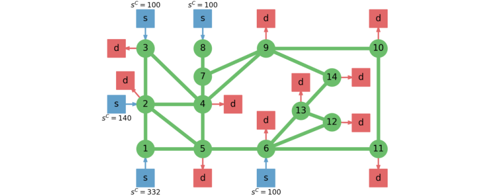

```@meta
CurrentModule = FlexibilityAnalysis
```

# Examples
This page provides two application examples that illustrate how FlexibilityAnalysis can be
used and highlight some of its capabilities.

## Heat Exchanger Network
This is a common benchmark example used in flexibility analysis literature. The
heat exchanger network is characterized according to the diagram below.


The system constraints are:

```math
\begin{equation}
 \begin{aligned}
  -350 K - 0.67 Q_c + T_3 &\leq 0 \\
  1388.5 K + 0.5 Q_c - 0.75 T_1 - T_3 - T_5 &\leq 0 \\
  2044 K + Q_c - 1.5 T_1 - 2 T_3 - T_5 &\leq 0 \\
  2830 K + Q_c - 1.5 T_1 - 2 T_3 - T_5 - 2 T_8 &\leq 0 \\
  -3153 K - Q_c + 1.5 T_1 + 2 T_3 + T_5 + 3 T_8 &\leq 0
 \end{aligned}
\end{equation}
```
where ``T_1``, ``T_3``, ``T_5``, and ``T_8`` denote the Gaussian parameters and
``Q_c`` denotes the recourse variable.  The mean and covariance matrix are given by:

```math
\begin{equation}
 \bar{\boldsymbol{\theta}} =
 \begin{bmatrix}
   620 \\ 388 \\ 583 \\ 313
   \end{bmatrix} K
   \ \ \ \ \ \
   V_{\boldsymbol{\theta}} =
   \begin{bmatrix}
   11.11 & 0 & 0 & 0 \\
   0 & 11.11 & 0 & 0 \\
   0 & 0 & 11.11 & 0 \\
   0 & 0 & 0 & 11.11
 \end{bmatrix} K^2
\end{equation}
```
The parameter variance ``\sigma_i^2`` is taken to be ``11.11 K^2`` which corresponds
to ``\bar{\theta}_i \pm 3 \sigma_i``, where ``3 \sigma_i`` is equated to ``10 K``
in accordance to the ``\pm 10 K`` variations historically reported.

Now that we have formalized the system parameters and equations we can setup and
solve a flexibility model. Let's first setup the model using a hyperbox uncertainty
set.

```julia
using FlexibilityAnalysis, JuMP
using Gurobi

# Setup the uncertainty set parameters
means = [620; 388; 583; 313]
covar = [11.11 0 0 0; 0 11.11 0 0; 0 0 11.11 0; 0 0 0 11.11]
box_dev = ones(4) * 10

# Setup the model
m = FlexibilityModel(solver = GurobiSolver(OutputFlag = 0))

# Define variables
@randomvariable(m, T[i = 1:4], mean = means[i])
@recoursevariable(m, Qc)

# Define the constraints
@constraint(m, -350 - 0.67Qc + T[2] <= 0.0)
@constraint(m, 1388.5 + 0.5Qc - 0.75T[1] - T[2] - T[3] <= 0.0)
@constraint(m, 2044 + Qc - 1.5T[1] - 2T[2] - T[3] <= 0.0)
@constraint(m, 2830 + Qc - 1.5T[1] - 2T[2] - T[3] - 2T[4] <= 0.0)
@constraint(m, -3153 - Qc + 1.5T[1] + 2T[2] + T[3] + 3T[4] <= 0.0)

# Define the uncertainty set
setuncertaintyset(m, :Hyperbox, [[box_dev]; [box_dev]]);
```

Before solving let's verify that the means provide a feasible nominal point.

```julia
isvalid = ismeanfeasible(m)
```
```julia
true
```

Since the mean is feasible we can proceed to solve `m` using all the default
settings and then extract the solution data.

```julia
# Solve
  status = solve(m)

  if status == :Optimal
      # Retrieve optimized data
      flexibility_index = getflexibilityindex(m)
      temperatures = getvalue(T)
      cooling = getvalue(Qc)
      actives = getactiveconstraints(m)

      # Print the results
      print("Flexibility Index:     ", round(flexibility_index, 4), "\n")
      print("Critical Temperatures: ", round.(temperatures, 2), "\n")
      print("Critical Cooling:      ", round(cooling, 2), "\n")
      print("Active Constraints:    ", actives)
  end
```
```julia
Flexibility Index:     0.5
Critical Temperatures: [615.0, 383.0, 578.0, 318.0]
Critical Cooling:      615.0
Active Constraints:    [2, 5]
```

This result indicates that the largest feasible hyperbox uncertainty set is given
by 50% of its nominal scale, meaning only ``\pm 5 K`` variations are feasible. Let's
now specify the covariance matrix so we can estimate the stochastic flexibility index.

```julia
setcovariance(m, covar)
SF = findstochasticflexibility(m, use_vulnerability_model = true)
```
```julia
0.9726
```

Now let's change the uncertainty set to be ellipsoidal and resolve. Notice that
we don't need to provide the covariance as an attribute because we already set it
with `setcovariance`. We also will enable diagonalization of the ellipsoidal
constraint by using the keyword argument `diag:Bool`.

```julia
# Change the uncertainty set
setuncertaintyset(m, :Ellipsoid)

# Solve
  status = solve(m, diag = true)

  if status == :Optimal
      # Retrieve optimized data
      flexibility_index = getflexibilityindex(m)
      temperatures = getvalue(T)
      cooling = getvalue(Qc)
      actives = getactiveconstraints(m)
      conf_lvl = getconfidencelevel(m)

      # Print the results
      print("Flexibility Index:     ", round(flexibility_index, 4), "\n")
      print("Confidence Level:      ", round(conf_lvl, 4), "\n")
      print("Critical Temperatures: ", round.(temperatures, 2), "\n")
      print("Critical Cooling:      ", round(cooling, 2), "\n")
      print("Active Constraints:    ", actives)
  end
```
```julia
Flexibility Index:     3.6004
Confidence Level:      0.5372
Critical Temperatures: [620.0, 388.0, 581.0, 319.0]
Critical Cooling:      620.0
Active Constraints:    [2, 5]
```

We note that the confidence level provides a lower bound on the stochastic
flexibility index as we expect.

## IEEE-14 Bus Power Network
We now consider the IEEE 14-node power network. Which we model by performing
balances at each node ``n \in \mathcal{C}`` and enforcing capacity constraints on
the arcs ``a_k, k \in \mathcal{A},`` and on the suppliers ``s_b, b \in \mathcal{S}``.
The demands ``d_m, m \in \mathcal{D},`` are assumed to be the uncertain parameters.
The flexibility index problem those seek to identify the largest set of simultaneous
demand withdrawals that the system can tolerate. The deterministic network model
is given by:

```math
\begin{equation}
	\sum_{k \in \mathcal{A}_n^{rec}} a_k - \sum_{k \in \mathcal{A}_n^{snd}} a_k + \sum_{b \in \mathcal{S}_n} s_b - \sum_{m \in \mathcal{D}_n} d_m = 0, \ \ \ n \in \mathcal{C}
\end{equation}
```
```math
\begin{equation}
	-a_k^C \leq a_k \leq a_k^C, \ \ \ k \in \mathcal{A}
\end{equation}
```
```math
\begin{equation}
	0 \leq s_b \leq s_b^C, \ \ \ b \in \mathcal{S}
\end{equation}
```
where ``\mathcal{A}_n^{rec}`` denotes the set of receiving arcs at node ``n``,
``\mathcal{A}_n^{snd}`` denotes the set of sending arcs at ``n``, ``\mathcal{S}_n``
denotes the set of suppliers at ``n``, ``\mathcal{D}_n`` denotes the set of demands
at ``n``, ``a_k^C`` are the arc capacities, and ``s_b^C`` are the supplier capacities.

This test case does not provide arc capacities so we enforce a capacity of 100 for
all the arcs. A schematic of this system is provided below.



This system is subjected to a total of 10 uncertainty disturbances (the network
demands). The demands are assumed to be ``\boldsymbol{\theta} \sim \mathcal{N}(\bar{\boldsymbol{\theta}}, V_{\boldsymbol{\theta}})``,
where ``\bar{\boldsymbol{\theta}} = \bar{\boldsymbol{\theta}}_{fc}`` and
``V_{\boldsymbol{\theta}} = 1200 \mathbb{I}``. We select the set
``T_{\infty}(\delta)``. Thus, we setup flexibility model.

```julia
using FlexibilityAnalysis, JuMP
using Gurobi, Pavito, Ipopt

# Set the dimensions
n_gens = 5
n_lines = 20
n_dems = 11

# Setup the uncertainty set parameters
covar = eye(n_dems) * 1200.

# Specify the network details
line_cap = 100
gen_cap = [332; 140; 100; 100; 100]

# Setup the model
m = FlexibilityModel(solver = PavitoSolver(mip_solver = GurobiSolver(OutputFlag = 0),
                     cont_solver = IpoptSolver(print_level = 0), log_level = 0,
                     mip_solver_drives = false))

# Define variables
@randomvariable(m, d[i = 1:n_dems], mean = 0) # Temperarily set the mean to 0
@recoursevariable(m, a[1:n_lines])
@recoursevariable(m, g[1:n_gens])

# Set the line capacity constraints
@constraint(m, [line = 1:n_lines], -line_cap <= a[line])
@constraint(m, [line = 1:n_lines], a[line] <= line_cap)

# Set the generator capacity constraints
@constraint(m, [gen = 1:n_gens], 0.0 <= g[gen])
@constraint(m, [gen = 1:n_gens], g[gen] <= gen_cap[gen])

# Set the node balance constraints
@constraint(m, g[1] - a[1] - a[6] == 0)
@constraint(m, a[1] + g[2] - sum(a[i] for i = [2; 4; 5]) - d[1] == 0)
@constraint(m, g[3] + a[2] - a[3] - d[2] == 0)
@constraint(m, sum(a[i] for i = [3; 4; 8]) - sum(a[i] for i = [7; 11]) - d[3] == 0)
@constraint(m, sum(a[i] for i = [5; 6; 7; 12]) - d[4] == 0)
@constraint(m, g[4] + sum(a[i] for i = [16; 18]) - sum(a[i] for i = [12; 19]) - d[5] == 0)
@constraint(m, a[9] - sum(a[i] for i = [8; 10]) == 0)
@constraint(m, g[5] - a[9] == 0)
@constraint(m, sum(a[i] for i = [10; 11]) - sum(a[i] for i = [13; 14]) - d[6] == 0)
@constraint(m, sum(a[i] for i = [13; 20]) - d[7] == 0)
@constraint(m, a[19] - a[20] - d[8] == 0)
@constraint(m, a[17] - a[18] - d[9] == 0)
@constraint(m, a[15] - sum(a[i] for i = [16; 17]) - d[10] == 0)
@constraint(m, a[14] - a[15] - d[11] == 0)

# Define the covariance and the uncertainty set
setcovariance(m, covar)
setuncertaintyset(m, :PNorm, Inf);
```

The flexibility model `m` is now defined, so now we compute the feasible center
and solve `m`.

```julia
# Compute a center to replace the mean if desired
new_mean = findcenteredmean(m, center = :feasible, solver = GurobiSolver(OutputFlag = 0),
                            update_mean = true)
updated_mean = getmean(m)

# Solve
status = solve(m)

if status == :Optimal
    # Retrieve optimized data
    flexibility_index = getflexibilityindex(m)
    lines = getvalue(a)
    generators = getvalue(g)
    demands = getvalue(d)
    actives = getactiveconstraints(m)

    # Print the results
    print("Flexibility Index:   ", round(flexibility_index, 4), "\n")
    print("Active Constraints:  ", actives)
end
```
```julia
Flexibility Index:   26.3636
Active Constraints:  [7, 14, 25, 33, 41, 42, 43, 44, 45]
```

Now we will use the `rankinequalities` function to obtain a ranking of the most
limiting components.

```julia
# Rank the inequality constraints
rank_data = rankinequalities(m, max_ranks = 3)
```
```julia
3-element Array{Dict,1}:
 Dict{String,Any}(Pair{String,Any}("flexibility_index", 26.3636),Pair{String,Any}("model", Feasibility problem with:
 * 64 linear constraints
 * 36 variables
Solver is Pavito),Pair{String,Any}("active_constraints", [7, 14, 25, 33, 41, 42, 43, 44, 45]))
 Dict{String,Any}(Pair{String,Any}("flexibility_index", 31.8181),Pair{String,Any}("model", Feasibility problem with:
 * 64 linear constraints
 * 36 variables
Solver is Pavito),Pair{String,Any}("active_constraints", [21, 26, 47, 48, 49, 50]))
 Dict{String,Any}(Pair{String,Any}("flexibility_index", 83.3332),Pair{String,Any}("model", Feasibility problem with:
 * 64 linear constraints
 * 36 variables
Solver is Pavito),Pair{String,Any}("active_constraints", [1, 2, 3, 4, 10, 11, 12, 19, 36, 38, 46]))
```

Thus, now we can identify which lines and generators most limit system flexibility.
We also observe how the flexibility index increases with each rank level as is
expected.
